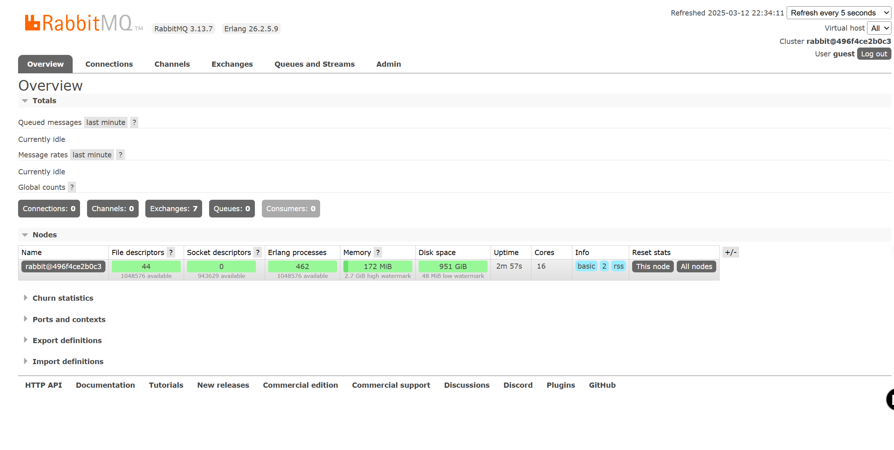

# Docker

docker 下简单的本地部署过程：
```docker
docker pull rabbitmq:3-docker pull rabbitmq:3-management

docker run -d --name rabbitmq -p 5672:5672 -p 15672:15672 rabbitmq:3-management
```

账号：guest
密码：guest

[RabbitMQ Management](http://localhost:15672/#/)


