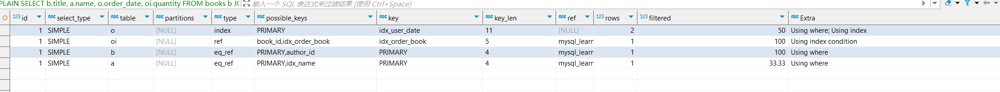

# Mysql 基础调优

## explain
基础语法：[explain.md](语法\explain.md) 

### 实践

环境准备：

```sql
-- 文件名: bookstore.sql
-- 描述: 在线书店数据库案例，用于学习 SQL 调优和 EXPLAIN 分析

-- authors 表 (作者表)
CREATE TABLE authors (
    author_id INT PRIMARY KEY AUTO_INCREMENT,
    name VARCHAR(100) NOT NULL,
    country VARCHAR(50),
    birth_year INT CHECK (birth_year > 1800),
    INDEX idx_name (name),
    INDEX idx_country_year (country, birth_year)
) ENGINE=InnoDB DEFAULT CHARSET=utf8mb4 COMMENT='作者信息表';

-- books 表 (书籍表)
CREATE TABLE books (
    book_id INT PRIMARY KEY AUTO_INCREMENT,
    title VARCHAR(200) NOT NULL,
    author_id INT,
    price DECIMAL(10, 2) NOT NULL,
    publish_date DATE,
    genre VARCHAR(50),
    stock INT DEFAULT 0,
    FOREIGN KEY (author_id) REFERENCES authors(author_id) ON DELETE SET NULL,
    INDEX idx_title (title(50)),
    INDEX idx_genre_price (genre, price),
    FULLTEXT INDEX idx_title_full (title)
) ENGINE=InnoDB DEFAULT CHARSET=utf8mb4 COMMENT='书籍信息表';

-- users 表 (用户表)
CREATE TABLE users (
    user_id INT PRIMARY KEY AUTO_INCREMENT,
    username VARCHAR(50) NOT NULL UNIQUE,
    email VARCHAR(100) NOT NULL UNIQUE,
    join_date DATETIME DEFAULT CURRENT_TIMESTAMP,
    INDEX idx_join_date (join_date)
) ENGINE=InnoDB DEFAULT CHARSET=utf8mb4 COMMENT='用户信息表';

-- orders 表 (订单表)
CREATE TABLE orders (
    order_id INT PRIMARY KEY AUTO_INCREMENT,
    user_id INT,
    order_date DATETIME DEFAULT CURRENT_TIMESTAMP,
    total_amount DECIMAL(10, 2),
    status ENUM('pending', 'shipped', 'completed', 'cancelled') DEFAULT 'pending',
    FOREIGN KEY (user_id) REFERENCES users(user_id) ON DELETE CASCADE,
    INDEX idx_user_date (user_id, order_date),
    INDEX idx_status (status)
) ENGINE=InnoDB DEFAULT CHARSET=utf8mb4 COMMENT='订单信息表';

-- order_items 表 (订单详情表)
CREATE TABLE order_items (
    item_id INT PRIMARY KEY AUTO_INCREMENT,
    order_id INT,
    book_id INT,
    quantity INT NOT NULL CHECK (quantity > 0),
    unit_price DECIMAL(10, 2) NOT NULL,
    FOREIGN KEY (order_id) REFERENCES orders(order_id) ON DELETE CASCADE,
    FOREIGN KEY (book_id) REFERENCES books(book_id) ON DELETE RESTRICT,
    INDEX idx_order_book (order_id, book_id)
) ENGINE=InnoDB DEFAULT CHARSET=utf8mb4 COMMENT='订单详情表';


-- 2. 插入测试数据

-- authors 数据
INSERT INTO authors (name, country, birth_year) VALUES
('J.K. Rowling', 'UK', 1965),
('George Orwell', 'UK', 1903),
('Haruki Murakami', 'Japan', 1949);

-- books 数据
INSERT INTO books (title, author_id, price, publish_date, genre, stock) VALUES
('Harry Potter', 1, 29.99, '1997-06-26', 'Fantasy', 50),
('1984', 2, 19.99, '1949-06-08', 'Dystopia', 30),
('Norwegian Wood', 3, 24.99, '1987-08-04', 'Fiction', 20);

-- users 数据
INSERT INTO users (username, email) VALUES
('alice', 'alice@example.com'),
('bob', 'bob@example.com');

-- orders 数据
INSERT INTO orders (user_id, order_date, total_amount, status) VALUES
(1, '2025-03-01 10:00:00', 59.98, 'completed'),
(2, '2025-03-15 14:30:00', 24.99, 'pending');

-- order_items 数据
INSERT INTO order_items (order_id, book_id, quantity, unit_price) VALUES
(1, 1, 2, 29.99),
(2, 3, 1, 24.99);

-- 3. 复杂查询示例


-- 查询 2: 统计某类型书籍的销售额并按价格排序
SELECT 'Query 2: 统计 Fantasy 类型书籍销售额' AS description;
EXPLAIN SELECT b.genre, SUM(oi.quantity * oi.unit_price) AS total_sales
FROM books b
JOIN order_items oi ON b.book_id = oi.book_id
WHERE b.genre = 'Fantasy'
GROUP BY b.genre
ORDER BY total_sales DESC;

-- 查询 3: 搜索标题含特定关键词的书籍并按库存排序
SELECT 'Query 3: 搜索标题含 Harry 的书籍' AS description;
EXPLAIN SELECT title, stock
FROM books
WHERE MATCH(title) AGAINST('Harry' IN BOOLEAN MODE)
ORDER BY stock DESC;

-- 4. 可选优化建议 (注释形式)
-- 为 orders.order_date 添加单独索引以优化 Query 1:
-- ALTER TABLE orders ADD INDEX idx_order_date (order_date);

-- 为 books 添加覆盖索引以优化 Query 2 (避免排序):
-- ALTER TABLE books ADD INDEX idx_genre_book (genre, book_id);

-- 结束
SELECT 'Bookstore SQL 案例结束' AS message;
```

**查询 1: 查找特定作者最近一个月订单中的书籍**

```sql
EXPLAIN SELECT b.title, a.name, o.order_date, oi.quantity
FROM books b
JOIN authors a ON b.author_id = a.author_id
JOIN order_items oi ON b.book_id = oi.book_id
JOIN orders o ON oi.order_id = o.order_id
WHERE a.name = 'J.K. Rowling' AND o.order_date >= '2025-02-20';
```



```
id | select_type | table | type   | possible_keys         | key           | key_len | ref                    | rows | filtered | Extra
1  | SIMPLE      | o     | index  | PRIMARY,idx_user_date | idx_user_date | 11      | NULL                   | 2    | 50.0     | Using where; Using index
1  | SIMPLE      | oi    | ref    | book_id,idx_order_book| idx_order_book| 5       | mysql_learn.o.order_id | 1    | 100.0    | Using index condition
1  | SIMPLE      | b     | eq_ref | PRIMARY,author_id     | PRIMARY       | 4       | mysql_learn.oi.book_id | 1    | 100.0    | Using where
1  | SIMPLE      | a     | eq_ref | PRIMARY,idx_name      | PRIMARY       | 4       | mysql_learn.b.author_id| 1    | 33.33    | Using where
```


思考过程：
这个 执行计划经历了什么过程？
还有什么可以优化的地方？
怎么完成进一步的优化？
我可以看出什么信息？

Question:

### **1 . 为什么 四行 id 都是 1？**

join 下真个语句是一个单一查询快，没有复杂的子查询、嵌套查询等

### **2 . 为什么有四条记录？**

多表查询，为每一个表指定执行计划。

### 3 . 逐行分析

#### **行 1：`orders` 表（`o`）**
- **`id: 1`**：
  - 表示这是第一个查询块，所有表属于同一个简单查询。
- **`select_type: SIMPLE`**：
  - 简单查询，无子查询或 UNION。
- **`table: o`**：
  - 处理 `orders` 表（别名为 `o`）。
- **`type: index`**：
  - 访问类型为索引扫描，扫描整个 `idx_user_date` 索引树。
  - 比全表扫描（`ALL`）高效，但不如 `range` 或 `ref` 精确。
- **`possible_keys: PRIMARY, idx_user_date`**：
  - 可用的索引：主键 `order_id` 和复合索引 `idx_user_date (user_id, order_date)`。
- **`key: idx_user_date`**：
  - 实际使用了 `idx_user_date`，可能是因为 `WHERE o.order_date >= '2025-02-20'`。
- **`key_len: 11`**：
  - 索引长度：`user_id INT (4字节)` + `order_date DATETIME (7字节，含NULL多1字节)` ≈ 11 字节。
  - 表示整个索引被使用。
- **`ref: NULL`**：
  - 无引用列，因为是索引扫描而非精确匹配。
- **`rows: 2`**：
  - 预计扫描 2 行，数据量小。
- **`filtered: 50.0`**：
  - 50% 的行通过 `WHERE o.order_date >= '2025-02-20'` 过滤，说明索引选择性一般。
- **`Extra: Using where; Using index`**：
  - `Using where`：`order_date` 条件需要过滤。
  - `Using index`：仅通过索引获取数据，无需回表。

**小结**：从 `orders` 开始，扫描 `idx_user_date` 索引，找到符合 `order_date` 条件的行。`type=index` 表示全索引扫描，效率可进一步优化。

---

#### **行 2：`order_items` 表（`oi`）**
- **`id: 1`**：
  - 与 `orders` 同属一个查询块。
- **`select_type: SIMPLE`**：
  - 简单查询的一部分。
- **`table: oi`**：
  - 处理 `order_items` 表（别名为 `oi`）。
- **`type: ref`**：
  - 使用非唯一索引查找匹配行，效率较高。
    
- **`possible_keys: book_id, idx_order_book`**：
  - 可用的索引：`book_id` 和 `idx_order_book (order_id, book_id)`。
- **`key: idx_order_book`**：
  - 选择了 `idx_order_book`，因为 `ON o.order_id = oi.order_id` 用到 `order_id`。
- **`key_len: 5`**：
  - `order_id INT (4字节)` + 1字节（允许 NULL），只用了索引的前缀。
- **`ref: mysql_learn.o.order_id`**： (“当前表使用索引查找时，拿什么来匹配？和前表的关系，类似于输入)
  - 与 `orders` 表的 `order_id` 列匹配。
- **`rows: 1`**：
  - 每行 `orders` 预计匹配 1 行 `order_items`。
- **`filtered: 100.0`**：
  - 100% 的行通过，无额外过滤。
- **`Extra: Using index condition`**：
  - 条件通过索引直接过滤，无需回表。

**小结**：`order_items` 通过 `idx_order_book` 与 `orders` 高效连接，每行 `orders` 匹配一行 `order_items`，性能良好。

---

#### **行 3：`books` 表（`b`）**
- **`id: 1`**：
  - 仍属同一查询块。
- **`select_type: SIMPLE`**：
  - 简单查询的一部分。
- **`table: b`**：
  - 处理 `books` 表（别名为 `b`）。
- **`type: eq_ref`**：
  - 通过主键或唯一索引查找唯一行，效率极高。
- **`possible_keys: PRIMARY, author_id`**：
  - 可用的索引：主键 `book_id` 和外键索引 `author_id`。
- **`key: PRIMARY`**：
  - 使用了主键 `book_id`。
- **`key_len: 4`**：
  - `book_id INT (4字节)`。
- **`ref: mysql_learn.oi.book_id`**：
  - 与 `order_items` 的 `book_id` 匹配。
- **`rows: 1`**：
  - 每行 `order_items` 对应 1 行 `books`。
- **`filtered: 100.0`**：
  - 无额外过滤，全部匹配。
- **`Extra: Using where`**：
  - 可能有隐式条件（但查询中未显式体现，可能与上下文无关）。

**小结**：`books` 通过主键 `book_id` 与 `order_items` 连接，`eq_ref` 表示最高效的访问方式。

---

#### **行 4：`authors` 表（`a`）**
- **`id: 1`**：
  - 同属一个查询块。
- **`select_type: SIMPLE`**：
  - 简单查询的一部分。
- **`table: a`**：
  - 处理 `authors` 表（别名为 `a`）。
- **`type: eq_ref`**：
  - 通过主键查找唯一行，效率极高。
- **`possible_keys: PRIMARY, idx_name`**：
  - 可用的索引：主键 `author_id` 和 `idx_name`。
- **`key: PRIMARY`**：
  - 使用了主键 `author_id`。
- **`key_len: 4`**：
  - `author_id INT (4字节)`。
- **`ref: mysql_learn.b.author_id`**：
  - 与 `books` 的 `author_id` 匹配。
- **`rows: 1`**：
  - 每行 `books` 对应 1 行 `authors`。
- **`filtered: 33.33`**：
  - 33.33% 的行通过过滤，可能有未显示的条件（如 `a.name = 'J.K. Rowling'`）。
- **`Extra: Using where`**：
  - 表示有条件过滤（可能是遗漏的 `WHERE` 条件）。

**小结**：`authors` 通过主键 `author_id` 与 `books` 连接，`filtered=33.33` 提示可能有额外条件未在假设查询中体现。

---

### 4. 执行计划整体流程
1. **从 `orders` 开始**：
   - 扫描 `idx_user_date`，找到 `order_date >= '2025-02-20'` 的 2 行（50% 过滤）。
2. **连接 `order_items`**：
   - 用 `o.order_id` 通过 `idx_order_book` 查找匹配行，每行匹配 1 行。
3. **连接 `books`**：
   - 用 `oi.book_id` 通过主键精确匹配，每行匹配 1 行。
4. **连接 `authors`**：
   - 用 `b.author_id` 通过主键匹配，每行匹配 1 行，33.33% 过滤可能来自额外条件。

---

### 5. 调优建议
1. **优化 `orders` 的访问**：
   - `type=index` 表示全索引扫描，可添加单独索引：
     ```sql
     ALTER TABLE orders ADD INDEX idx_order_date (order_date);
     ```
     预期：`type` 变为 `range`，`filtered` 更精确。
2. **确认完整查询**：
   - `a` 的 `filtered=33.33` 和 `Using where` 暗示可能有条件（如 `a.name = 'xxx'`），需确认。
3. **覆盖索引**：
   - 若只选部分列，可优化索引为覆盖索引，避免回表。

