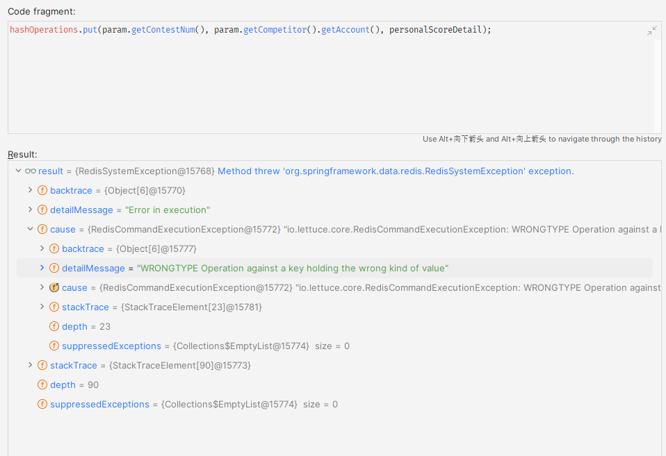

# Redis - 项目经验以及bug 积累

该篇笔记收录一些在项目过程中，遇到的和redis 相关的一些问题以及解决。

## 1. Reids 中的Key 

**场景复现**: 在编写OJ项目的时候，我编写这样一段维护排行榜的代码。

```Java
    public void updateRedisBoard(UpdateScoreAttempt param, PersonalScore personalScoreDetail) {

        // 记录罚时次数。
        Integer passedProblemCount = calPassedProblemCount(personalScoreDetail);
        Integer punishCount = calPunishCount(personalScoreDetail);
        Long passTimeSum = calPassTimeSum(personalScoreDetail);

        Double scoreHash = scoreHash(passedProblemCount, passTimeSum, punishCount);

        zSetOperations.add(param.getContestNum(),
                param.getCompetitor().getAccount(), scoreHash);

        // 2. 更新个人状态
        hashOperations.put(param.getContestNum(), param.getCompetitor().getAccount(), personalScoreDetail);
        // 完成校验，判定为有效提交。 更新排行榜排名。
    }
```

报错显示：



Redis 对数据中的管理是面向Key 的。 一个key 只能指代一个集合。zset 操作中我们创建了一个zset 类型的key。当我们使用 Hash 客户端对这个 zset类型 的集合进行操作，这是相当显然的错误。