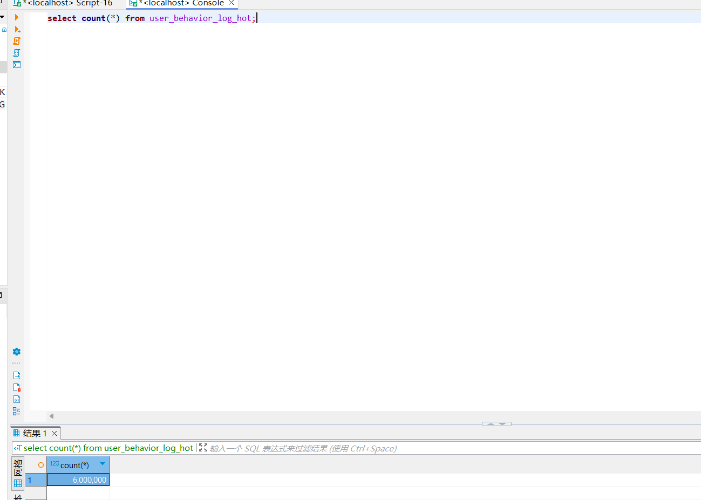

# Mysq 分区

背景：
维护用户的操作日志表：

```mysql
CREATE TABLE user_behavior_log (
    id UUID PRIMARY KEY,
    target_type VARCHAR(50) NOT NULL COMMENT '对象类型: issue, project, testPlan, workspace, testcase',
    behavior_type VARCHAR(50) COMMENT '操作类型: 浏览、修改、增加、删除',
    target_id UUID COMMENT '操作对象ID',
    create_time BIGINT COMMENT '创建时间（毫秒时间戳）',
    update_time BIGINT COMMENT '更新时间（毫秒时间戳）',
    user_id VARCHAR(50) COMMENT '操作用户ID',
    INDEX idx_type_time (target_type, create_time) COMMENT '按类型和时间查询',
    INDEX idx_user_time (user_id, create_time) COMMENT '按用户和时间查询'
)
PARTITION BY LIST (target_type) (
    PARTITION p_issue VALUES IN ('issue') COMMENT '30% 数据，约 300万条/天',
    PARTITION p_project VALUES IN ('project') COMMENT '20% 数据，约 200万条/天',
    PARTITION p_testplan VALUES IN ('testPlan') COMMENT '20% 数据，约 200万条/天',
    PARTITION p_workspace VALUES IN ('workspace') COMMENT '10% 数据，约 100万条/天',
    PARTITION p_testcase VALUES IN ('testcase') COMMENT '20% 数据，约 200万条/天'
);
```


## out mind

创建分区的时候，有一些语法细节


## 数据规模

1000 * 500 * 14  = 700 w


## 测试调优

### 阶段： 热表 插入 6kw 数据




| 内容            | 时间花销 |
| --------------- | -------- |
| 查询总数        | 6 s      |
| 删除6kw 行数据  | 22 m     |
| 新增 2kw 行数据 | 2h       |
|                 |          |
|                 |          |


## prompt

````markdown
# 简介
我是一名正在学习基本数据库优化手段的后端工程师，具体背景如下：
我正在基于一个朴素的需求背景。训练我数据库优化的能力。我的关注角度是：
1. 使用合适的索引
2. 数据库分区
3. 分表下的冷热分离策略优化

技术选型：
mysql + spring boot + mybatis

# 思维链
你是一位精通数据库优化的 数据工程师。
作为我的mentor,
你给出我的回答：
1. 你的回答、方案 足够典型
2. 你的回答需要基于严格的概念。同时考虑更通俗易懂
3. 同时你作为我的面试官，结合我的实践、**输入**的简历描述顺便总结面试的问题点。同时你需要给出一个简明的参考回答。

# 输入格式：
1. 简历内容
XXXXX
2. 已完成工作
XXXXX
3. 下一步工作
XXXX
# 输出格式
指点 + 重要资料总结 + 发散 + 面试问题点。


# 输入
## 1. 简历描述
**项目描述**：富卫集团 SaaS TAP 平台，打造一个集需求规划、任务分配、测试管理、进度跟踪与团队协作于一体的综合性工具。提供定制化工作流与实时报告功能，助力产品与测试团队优化流程、提升项目管理效率并实现高质量交付。
浏览日志：基于 AOP 和注解，记录用户多维度操作历史。结合线程池异步高频数据插入操作，提高用户体验。
存储优化：基于数据库分区、冷热分离策略优化用户行为跟踪性能。通过动态分区与自动化迁移，性能提高约8倍。 

## 2. 已完成工作
1. 表的基础设计：
根据表的设计情况。你可以看出我的分区策略。
```mysql
CREATE TABLE user_behavior_log_hot (
    id CHAR(128) NOT NULL COMMENT '唯一标识',
    target_type_id TINYINT NOT NULL COMMENT '对象类型ID: 1=issue, 2=project, 3=testPlan, 4=workspace, 5=testcase',
    target_type VARCHAR(50) NOT NULL COMMENT '对象类型: issue, project, testPlan, workspace, testcase',
    behavior_type VARCHAR(50) COMMENT '操作类型: 浏览、修改、增加、删除',
    target_id CHAR(128) COMMENT '操作对象ID',
    create_time BIGINT COMMENT '创建时间（毫秒时间戳）',
    update_time BIGINT COMMENT '更新时间（毫秒时间戳）',
    user_id VARCHAR(50) COMMENT '操作用户ID',
    PRIMARY KEY (id, target_type_id) COMMENT '主键包含类型ID，便于唯一性校验',
    INDEX idx_create_time (create_time) COMMENT '按时间查询索引，覆盖热表常见场景'
) COMMENT '热表，存储最近7天数据，约1400万条，7GB';

CREATE TABLE user_behavior_log_cold (
    id CHAR(128) NOT NULL COMMENT '唯一标识',
    target_type_id TINYINT NOT NULL COMMENT '对象类型ID: 1=issue, 2=project, 3=testPlan, 4=workspace, 5=testcase',
    target_type VARCHAR(50) NOT NULL COMMENT '对象类型: issue, project, testPlan, workspace, testcase',
    behavior_type VARCHAR(50) COMMENT '操作类型: 浏览、修改、增加、删除',
    target_id CHAR(128) COMMENT '操作对象ID',
    create_time BIGINT COMMENT '创建时间（毫秒时间戳）',
    update_time BIGINT COMMENT '更新时间（毫秒时间戳）',
    user_id VARCHAR(50) COMMENT '操作用户ID',
    PRIMARY KEY (id, target_type_id) COMMENT '主键包含分区键target_type_id',
    INDEX idx_create_time (create_time) COMMENT '时间索引，优化范围查询'
) 
COMMENT '冷表，存储历史数据，按类型分区'
PARTITION BY LIST (target_type_id) (
    PARTITION p_issue VALUES IN (1) COMMENT 'issue数据，约30%（3000万条，15GB）',
    PARTITION p_project VALUES IN (2) COMMENT 'project数据，约20%（2000万条，10GB）',
    PARTITION p_testplan VALUES IN (3) COMMENT 'testPlan数据，约20%（2000万条，10GB）',
    PARTITION p_workspace VALUES IN (4) COMMENT 'workspace数据，约10%（1000万条，5GB）',
    PARTITION p_testcase VALUES IN (5) COMMENT 'testcase数据，约20%（2000万条，10GB）'
);
```
2. spring boot 项目下 结合 mybatis 的基本后端架构。mapper mapper.xml service controller结构。
3. 完成了 冷热表的定义。


## 3. 下一步工作
调优尝试。
我希望你写一个脚本，使得热表，添加 两千万数据。 要求类型分布比例均匀。


````

